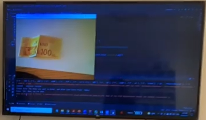
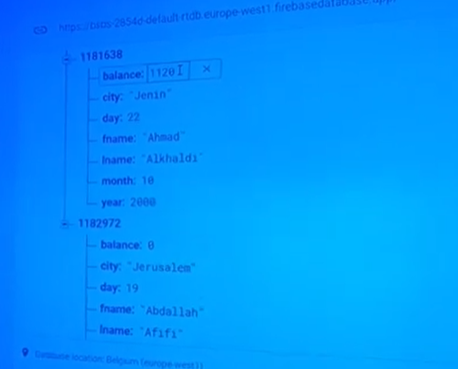
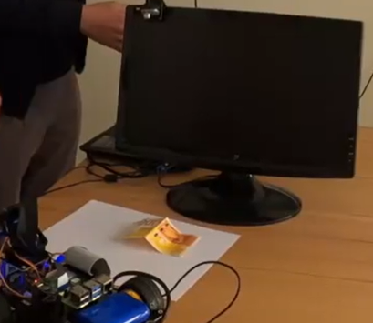

<!DOCTYPE html>
<html>
<head>
  <title>Smart Money Storage System</title>
</head>
<body>

<h1>Smart Money Storage System</h1>

<h2>Overview</h2>

The Smart Money Storage System is a fun hardware and software solution that enables efficient money storage and management. This system combines the power of Raspberry Pi as hardware, facial recognition for user authentication, and object detection for money scanning. It is designed to simplify money storage and tracking.

<h3>Key Features</h3>
<ul>
  <li><strong>Facial Recognition:</strong> The system uses facial recognition AI to authenticate users. New users can create accounts by having their faces scanned, while existing users can log in quickly.</li>
  <li><strong>Money Scanning:</strong> Users can deposit money into the system, which then scans and records the denomination of the currency. This data is securely stored for future reference.</li>
  <li><strong>Real-time Storage:</strong> Money deposits and account updates are managed using Firebase Realtime Database. Users can check their account balance and transaction history in real-time.</li>
  <li><strong>Socket Programming:</strong> The system leverages socket programming to establish communication between the Raspberry Pi and the user's PC. This ensures a user-friendly and efficient experience.</li>
</ul>

  
  
  
  

